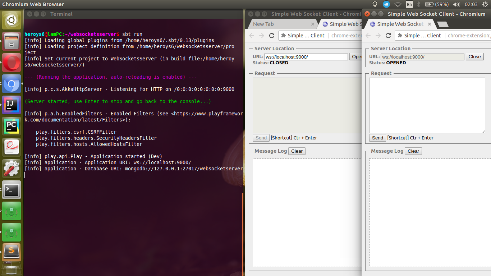
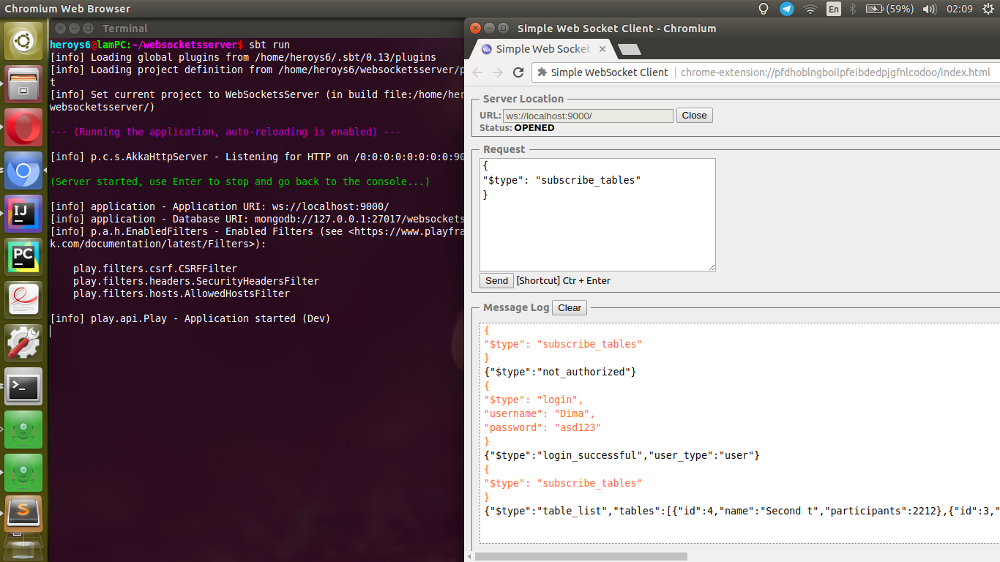
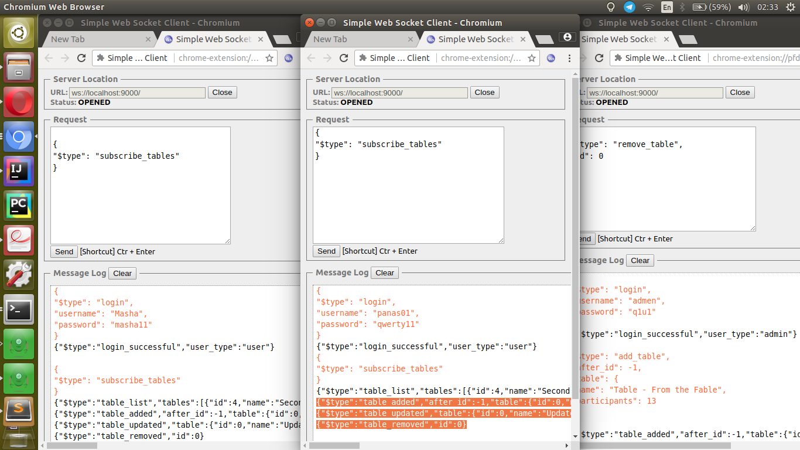

# WebSocket server
**Used technologies:**
* Akka Actors
* Play WebSocket
* ReactiveMongo Play plugin
* MongoDB
* Great power of Scala

**How to run:**


Run the server:
```Shell
cd websocketsserver/
sbt run
```
WebSocket will accept connections on:
```Shell
ws://localhost:9000/
```
Tested using Chrome extension [Simple WebSocket Client](https://chrome.google.com/webstore/detail/simple-websocket-client/pfdhoblngboilpfeibdedpjgfnlcodoo)


**Screenshots:**
<p align="center"><br><br></p>